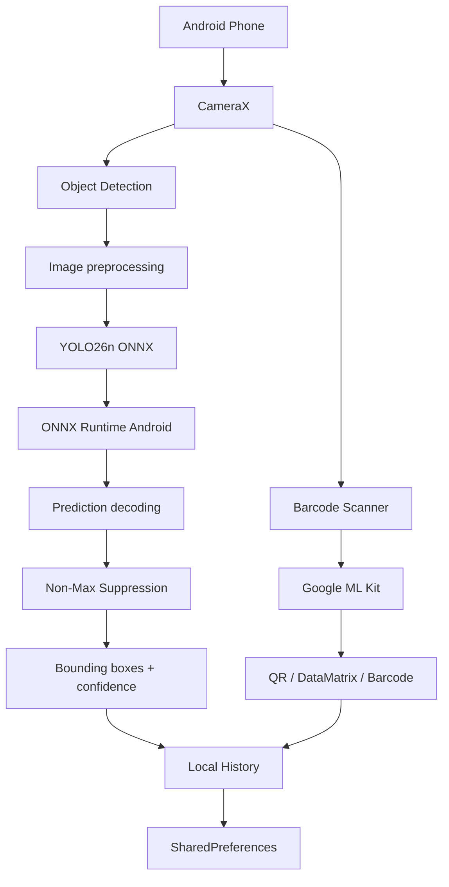

# VisionTrack AI

**Native Android computer vision that runs fully on-device.**

VisionTrack AI is a portfolio project built to demonstrate practical mobile AI engineering: native Android development, camera integration, object detection, barcode recognition, edge inference, and local-first data handling.

> **No backend. No cloud inference. No Wi-Fi required.**

---

## Highlights

- **Native Android** — Kotlin + Jetpack Compose
- **On-device object detection** — YOLO26n exported to ONNX
- **Edge inference** — ONNX Runtime Android
- **Camera integration** — CameraX
- **Barcode recognition** — QR, DataMatrix, EAN, Code 128 and more
- **Local history** — scan results are stored only on the device
- **Offline-first** — the entire app continues working without network access
- **Privacy-friendly** — captured images do not leave the device

---

## Demo

### Home
A product-style dashboard with:

- offline AI status
- YOLO model/runtime information
- recent activity
- object detection
- barcode scanning
- local scan history

### Object Detection

```text
CameraX
   ↓
Capture image
   ↓
Resize + normalize
   ↓
YOLO26n ONNX
   ↓
ONNX Runtime
   ↓
Decode predictions
   ↓
Non-Max Suppression
   ↓
Bounding boxes + confidence
```

The app reports:

- object class
- confidence
- number of detections
- inference time

### Barcode Scanner

The scanner supports common formats including:

- QR Code
- DataMatrix
- Code 128
- EAN-13
- EAN-8
- UPC-A / UPC-E
- PDF417
- Aztec

Scanning is performed locally using Google ML Kit.

---

## Architecture



Everything inside this architecture runs directly on the Android device.

---

## Tech Stack

| Area | Technology |
|---|---|
| Language | Kotlin |
| UI | Jetpack Compose + Material 3 |
| Camera | CameraX |
| Object Detection | YOLO26n |
| Model Format | ONNX |
| AI Runtime | ONNX Runtime Android |
| Barcode Recognition | Google ML Kit |
| Persistence | SharedPreferences |
| Build | Gradle |
| Minimum Android | API 26 |

---

## Why I Built This

This project was built to explore the intersection of:

- native mobile development
- computer vision
- camera-based applications
- AI inference on edge devices
- barcode/component identification
- privacy-conscious mobile architecture

Instead of sending camera images to a server, VisionTrack performs inference directly on the phone.

That creates useful engineering trade-offs around:

- latency
- model size
- CPU usage
- image preprocessing
- mobile memory constraints
- offline support
- privacy
- device-specific performance

---

## Relevance to Mobile AI / Computer Vision Roles

| Requirement | Demonstrated in VisionTrack |
|---|---|
| Android development | Native Kotlin + Jetpack Compose |
| Mobile camera | CameraX preview and capture |
| AI | YOLO26n object detection |
| Computer vision | Detection, confidence, bounding boxes |
| Image recognition | On-device model inference |
| Barcode recognition | ML Kit scanner |
| Edge AI | ONNX Runtime on Android |
| Offline applications | No backend required |
| Product development | Full UI, navigation, history and states |

---

## Project Structure

```text
visiontrack-ai/
├── app/
│   ├── build.gradle.kts
│   └── src/main/
│       ├── AndroidManifest.xml
│       ├── assets/
│       │   ├── coco80.txt
│       │   └── yolo26n.onnx        # generated locally
│       ├── java/com/visiontrack/standalone/
│       │   ├── MainActivity.kt
│       │   ├── ai/
│       │   │   └── YoloDetector.kt
│       │   ├── data/
│       │   │   └── LocalHistoryStore.kt
│       │   ├── model/
│       │   └── ui/
│       │       ├── DetectionOverlay.kt
│       │       └── theme/
│       └── res/
├── docs/
│   ├── ARCHITECTURE.md
│   └── screenshots/
├── tools/
│   ├── export_yolo26.py
│   └── prepare_model.ps1
├── build.gradle.kts
├── settings.gradle.kts
└── README.md
```

---

## Getting Started

### Requirements

- Android Studio
- Android SDK 36
- JDK 17
- Python 3.12+ for one-time YOLO export
- Android phone or emulator

### 1. Clone

```bash
git clone https://github.com/YOUR_USERNAME/visiontrack-ai.git
cd visiontrack-ai
```

### 2. Prepare YOLO26n

The model binary is intentionally not committed to Git.

On Windows PowerShell:

```powershell
Set-ExecutionPolicy -Scope Process -ExecutionPolicy Bypass
.\tools\prepare_model.ps1
```

This creates:

```text
app\src\main\assets\yolo26n.onnx
```

Verify:

```powershell
dir .\app\src\main\assets\yolo26n.onnx
```

### 3. Open in Android Studio

Open the repository root.

Set:

```text
Gradle JDK = JDK 17
```

Then allow Gradle sync to finish.

### 4. Build APK

From Android Studio:

```text
Build
→ Build App Bundle(s) / APK(s)
→ Build APK(s)
```

Or from PowerShell:

```powershell
.\gradlew.bat clean
.\gradlew.bat assembleDebug
```

Generated APK:

```text
app\build\outputs\apk\debug\app-debug.apk
```

---

## Model Pipeline

The pretrained YOLO26n model is exported once from PyTorch to ONNX:

```python
from ultralytics import YOLO

model = YOLO("yolo26n.pt")
model.export(
    format="onnx",
    imgsz=640,
    dynamic=False,
    simplify=True,
    nms=False,
)
```

The Android application then performs:

1. image capture
2. resize to `640 × 640`
3. RGB normalization
4. NCHW tensor creation
5. ONNX inference
6. output decoding
7. confidence filtering
8. non-max suppression
9. coordinate scaling
10. bounding-box rendering

---

## Privacy

VisionTrack does not require:

- user accounts
- cloud storage
- external AI APIs
- image uploads
- backend servers

Object detection and barcode recognition happen locally on the Android device.

---

## Screenshots

Add real screenshots after installing the app on your device:

```text
docs/screenshots/home.png
docs/screenshots/detection.png
docs/screenshots/barcode.png
docs/screenshots/history.png
```

Then replace this section with:

```markdown
<p align="center">
  
  
  
  
</p>
```

---

## Future Improvements

Potential extensions:

- real-time YOLO inference on camera frames
- NNAPI / hardware acceleration benchmarking
- model quantization
- component-specific fine-tuned detection
- DataMatrix-based component lookup
- Room database for richer local history
- exportable inspection reports
- iOS counterpart
- benchmark screen for FPS / CPU / memory

---

## Interview Talking Points

A few engineering decisions worth discussing:

**Why on-device inference?**  
Lower latency, offline operation, privacy and no server infrastructure.

**Why ONNX?**  
The model can be exported on Windows and executed natively on Android through ONNX Runtime.

**Why CameraX?**  
It provides lifecycle-aware native Android camera integration and works cleanly with Compose.

**Why separate YOLO and barcode recognition?**  
They solve different vision problems. YOLO performs object detection while ML Kit provides highly optimized decoding for structured barcode formats.

**Why capture-first rather than real-time YOLO?**  
The first version prioritizes correctness, predictable device load and a stable user experience. Real-time frame inference is a natural next optimization.

---

## Status

**Working Android prototype**

- [x] Native Kotlin UI
- [x] CameraX
- [x] YOLO26n
- [x] ONNX Runtime
- [x] Bounding boxes
- [x] Confidence scores
- [x] QR / barcode scanning
- [x] Local history
- [x] Offline mode
- [x] Installable Android APK
