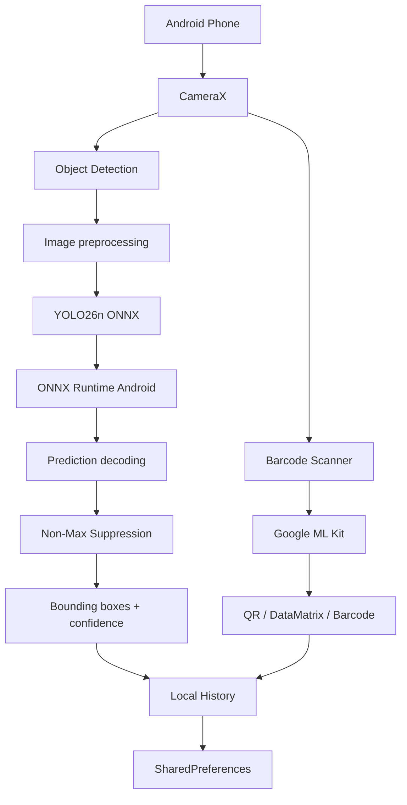

# VisionTrack AI

**Native Android computer vision that runs fully on-device.**

VisionTrack AI is a portfolio project built to demonstrate practical mobile AI engineering: native Android development, camera integration, object detection, barcode recognition, edge inference, and local-first data handling.

> **No backend. No cloud inference. No Wi-Fi required.**

---

## Highlights

- **Native Android** — Kotlin + Jetpack Compose
- **On-device object detection** — YOLO26n exported to ONNX
- **Edge inference** — ONNX Runtime Android
- **Camera integration** — CameraX
- **Barcode recognition** — QR, DataMatrix, EAN, Code 128 and more
- **Local history** — scan results are stored only on the device
- **Offline-first** — the entire app continues working without network access
- **Privacy-friendly** — captured images do not leave the device

---

## Screenshots

<p align="center">
  
  
  
  
</p>

<p align="center">
  <sub>
    Home &nbsp;&nbsp;&nbsp;&nbsp;&nbsp;
    Object Detection &nbsp;&nbsp;&nbsp;&nbsp;&nbsp;
    Barcode Scanner &nbsp;&nbsp;&nbsp;&nbsp;&nbsp;
    History
  </sub>
</p>

---

## Demo

### Home

The home screen provides a product-style dashboard with:

- offline AI status
- YOLO model/runtime information
- recent activity
- object detection
- barcode scanning
- local scan history

### Object Detection

```text
CameraX
   ↓
Capture image
   ↓
Resize + normalize
   ↓
YOLO26n ONNX
   ↓
ONNX Runtime
   ↓
Decode predictions
   ↓
Non-Max Suppression
   ↓
Bounding boxes + confidence
```

The app reports:

- object class
- confidence
- number of detections
- inference time

### Barcode Scanner

The scanner supports common formats including:

- QR Code
- DataMatrix
- Code 128
- EAN-13
- EAN-8
- UPC-A / UPC-E
- PDF417
- Aztec

Scanning is performed locally using Google ML Kit.

---

## Architecture



Everything in this architecture runs directly on the Android device.

---

## Tech Stack

| Area | Technology |
|---|---|
| Language | Kotlin |
| UI | Jetpack Compose + Material 3 |
| Camera | CameraX |
| Object Detection | YOLO26n |
| Model Format | ONNX |
| AI Runtime | ONNX Runtime Android |
| Barcode Recognition | Google ML Kit |
| Persistence | SharedPreferences |
| Build | Gradle |
| Minimum Android | API 26 |

---

## Why I Built This

This project was built to explore the intersection of:

- native mobile development
- computer vision
- camera-based applications
- AI inference on edge devices
- barcode and component identification
- privacy-conscious mobile architecture

Instead of sending camera images to a server, VisionTrack performs inference directly on the phone.

That creates useful engineering trade-offs around:

- latency
- model size
- CPU usage
- image preprocessing
- mobile memory constraints
- offline support
- privacy
- device-specific performance

---

## Relevance to Mobile AI / Computer Vision Roles

| Requirement | Demonstrated in VisionTrack |
|---|---|
| Android development | Native Kotlin + Jetpack Compose |
| Mobile camera | CameraX preview and capture |
| AI | YOLO26n object detection |
| Computer vision | Detection, confidence, bounding boxes |
| Image recognition | On-device model inference |
| Barcode recognition | Google ML Kit scanner |
| Edge AI | ONNX Runtime on Android |
| Offline applications | No backend required |
| Product development | Full UI, navigation, history and states |

---

## Project Structure

```text
visiontrack-ai/
├── app/
│   ├── build.gradle.kts
│   └── src/main/
│       ├── AndroidManifest.xml
│       ├── assets/
│       │   ├── coco80.txt
│       │   └── yolo26n.onnx
│       ├── java/com/visiontrack/standalone/
│       │   ├── MainActivity.kt
│       │   ├── ai/
│       │   │   └── YoloDetector.kt
│       │   ├── data/
│       │   │   └── LocalHistoryStore.kt
│       │   ├── model/
│       │   │   ├── Detection.kt
│       │   │   └── HistoryItem.kt
│       │   └── ui/
│       │       ├── DetectionOverlay.kt
│       │       └── theme/
│       │           └── Theme.kt
│       └── res/
├── docs/
│   ├── ARCHITECTURE.md
│   └── screenshots/
│       ├── home.jpg
│       ├── detection.jpg
│       ├── barcode.jpg
│       └── history.jpg
├── tools/
│   ├── export_yolo26.py
│   └── prepare_model.ps1
├── build.gradle.kts
├── gradle.properties
├── settings.gradle.kts
├── gradlew
├── gradlew.bat
└── README.md
```

---

## Getting Started

### Requirements

- Android Studio
- Android SDK 36
- JDK 17
- Python 3.12+ for one-time YOLO export
- Android phone or emulator

---

### 1. Clone the Repository

```bash
git clone https://github.com/ganesh-k7/visiontrack-ai.git
cd visiontrack-ai
```

---

### 2. Prepare YOLO26n

The model binaries are intentionally not committed to Git.

On Windows PowerShell:

```powershell
Set-ExecutionPolicy -Scope Process -ExecutionPolicy Bypass
.\tools\prepare_model.ps1
```

The script exports YOLO26n to ONNX and places the generated model at:

```text
app\src\main\assets\yolo26n.onnx
```

Verify that the model exists:

```powershell
dir .\app\src\main\assets\yolo26n.onnx
```

---

### 3. Open in Android Studio

Open the repository root in Android Studio.

Configure:

```text
Gradle JDK = JDK 17
```

Then allow Gradle sync to complete.

---

### 4. Build the APK

From Android Studio:

```text
Build
→ Build App Bundle(s) / APK(s)
→ Build APK(s)
```

Or from PowerShell:

```powershell
.\gradlew.bat clean
.\gradlew.bat assembleDebug
```

The generated debug APK will be available at:

```text
app\build\outputs\apk\debug\app-debug.apk
```

---

## Model Pipeline

The pretrained YOLO26n model is exported once from PyTorch to ONNX.

```python
from ultralytics import YOLO

model = YOLO("yolo26n.pt")

model.export(
    format="onnx",
    imgsz=640,
    dynamic=False,
    simplify=True,
    nms=False,
)
```

The Android application then performs the following pipeline:

1. capture an image using CameraX
2. resize the image to `640 × 640`
3. convert pixels to RGB
4. normalize input values
5. construct an NCHW tensor
6. run inference using ONNX Runtime
7. decode YOLO predictions
8. filter detections using confidence thresholds
9. perform non-max suppression
10. scale coordinates back to the original image
11. render bounding boxes and confidence scores

---

## On-Device Object Detection

YOLO26n is executed directly on the Android device using ONNX Runtime.

The application does not need to upload an image to a server before receiving a prediction.

This provides:

- lower inference latency
- offline functionality
- no dependency on network connectivity
- no server-side AI infrastructure
- greater privacy for captured images

The current implementation uses capture-first inference rather than continuous frame-by-frame detection.

---

## Barcode Recognition

Barcode recognition is handled using Google ML Kit.

Supported formats include:

- QR Code
- DataMatrix
- Code 128
- EAN-13
- EAN-8
- UPC-A
- UPC-E
- PDF417
- Aztec

The barcode processing pipeline also runs locally on the Android device.

---

## Local History

Detection and scanning activity is stored locally using Android `SharedPreferences`.

The history screen allows the user to view previous activity without requiring:

- a database server
- authentication
- cloud synchronization
- an internet connection

The current prototype keeps the persistence layer intentionally lightweight.

A future version could migrate this functionality to Room for richer querying and structured persistence.

---

## Privacy

VisionTrack does not require:

- user accounts
- cloud storage
- external AI APIs
- image uploads
- backend servers
- remote databases

Object detection and barcode recognition happen locally on the Android device.

Captured images do not need to leave the phone for inference.

---

## Engineering Decisions

### Why On-Device Inference?

Running the model directly on the phone provides several advantages:

- lower latency
- offline operation
- improved privacy
- reduced infrastructure requirements
- predictable local processing
- no API usage costs

It also introduces interesting engineering constraints such as:

- model size
- memory usage
- CPU performance
- preprocessing cost
- inference latency
- device compatibility

---

### Why ONNX?

ONNX provides a portable model format that allows the original YOLO model to be exported and executed outside its original PyTorch environment.

For this project, ONNX makes it possible to:

- export the model on a development machine
- package it with the Android application
- execute inference through ONNX Runtime Android
- avoid running Python on the mobile device

---

### Why CameraX?

CameraX provides lifecycle-aware camera APIs for native Android development.

It simplifies:

- camera preview
- image capture
- lifecycle management
- device compatibility

It also integrates cleanly with a Jetpack Compose application.

---

### Why Jetpack Compose?

Jetpack Compose was used to build the user interface because it provides a modern declarative approach to native Android development.

The application includes:

- a dashboard-style home screen
- object detection workflow
- barcode scanner
- scan history
- navigation
- detection status
- inference statistics

---

### Why Separate YOLO and Barcode Recognition?

Object recognition and barcode decoding are different computer vision tasks.

YOLO is used for general object detection, while Google ML Kit provides optimized decoding for structured barcode formats.

Using specialized tools for each task provides a more reliable architecture than trying to make one model handle both problems.

---

### Why Capture-First Detection?

The first version performs detection after capturing an image instead of running YOLO continuously on every camera frame.

This approach prioritizes:

- stable inference
- predictable device load
- simpler image preprocessing
- lower CPU usage
- easier debugging
- consistent detection results

Real-time frame inference is a natural future optimization.

---

## Future Improvements

Potential extensions include:

- real-time YOLO inference on camera frames
- FPS benchmarking
- NNAPI acceleration
- hardware acceleration benchmarking
- model quantization
- smaller optimized ONNX models
- component-specific fine-tuned detection
- DataMatrix-based component identification
- component database lookup
- Room database for local history
- exportable inspection reports
- image annotation export
- confidence threshold controls
- configurable object classes
- CPU usage monitoring
- memory usage monitoring
- inference benchmark screen
- iOS counterpart

---

## Possible Industrial Extension

The current application uses the general-purpose COCO object classes provided by the pretrained YOLO model.

For an industrial use case, the same architecture could be extended by fine-tuning YOLO on domain-specific data such as:

- electronic components
- mechanical components
- industrial labels
- manufacturing defects
- product parts
- machine components

The resulting model could replace the current general-purpose model without requiring major changes to the Android inference pipeline.

A component recognition workflow could therefore become:

```text
Camera
   ↓
Component Detection
   ↓
YOLO domain-specific model
   ↓
Component ID
   ↓
Barcode / DataMatrix scan
   ↓
Local or remote component database
   ↓
Component information
```

---

## Status

**Working Android prototype**

- [x] Native Kotlin application
- [x] Jetpack Compose UI
- [x] CameraX
- [x] YOLO26n
- [x] ONNX export
- [x] ONNX Runtime Android
- [x] On-device inference
- [x] Bounding boxes
- [x] Confidence scores
- [x] Inference timing
- [x] QR scanning
- [x] Barcode scanning
- [x] Local history
- [x] Offline operation
- [x] Installable Android APK
- [x] Application screenshots

---

## Repository Notes

Large binary files are intentionally excluded from the Git repository, including:

```text
yolo26n.pt
yolo26n.onnx
app/src/main/assets/yolo26n.onnx
*.apk
*.aab
```

This keeps the repository lightweight while still providing the scripts required to recreate the model locally.

---

## Author

Built as a portfolio project to demonstrate practical experience with:

- Android development
- Kotlin
- Jetpack Compose
- computer vision
- YOLO
- ONNX
- edge AI
- CameraX
- barcode recognition
- local-first mobile architecture

GitHub: [ganesh-k7](https://github.com/ganesh-k7)
