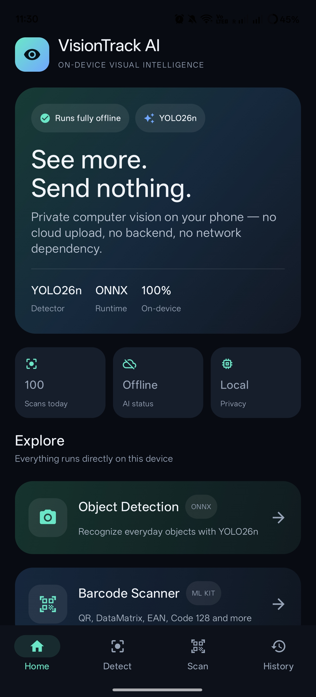
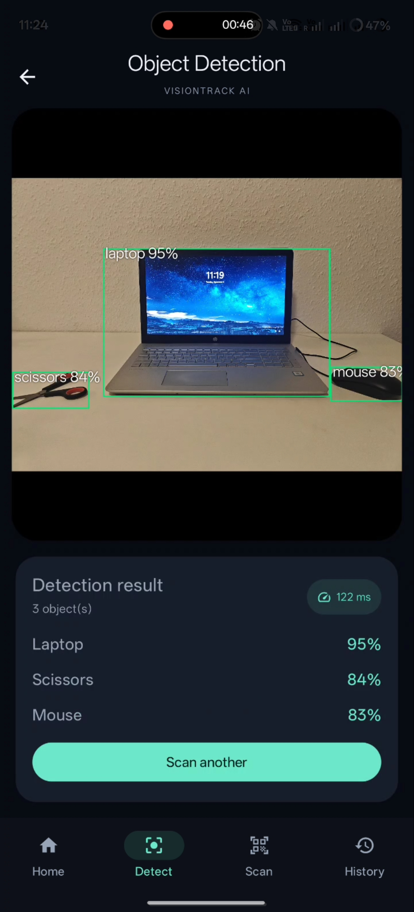
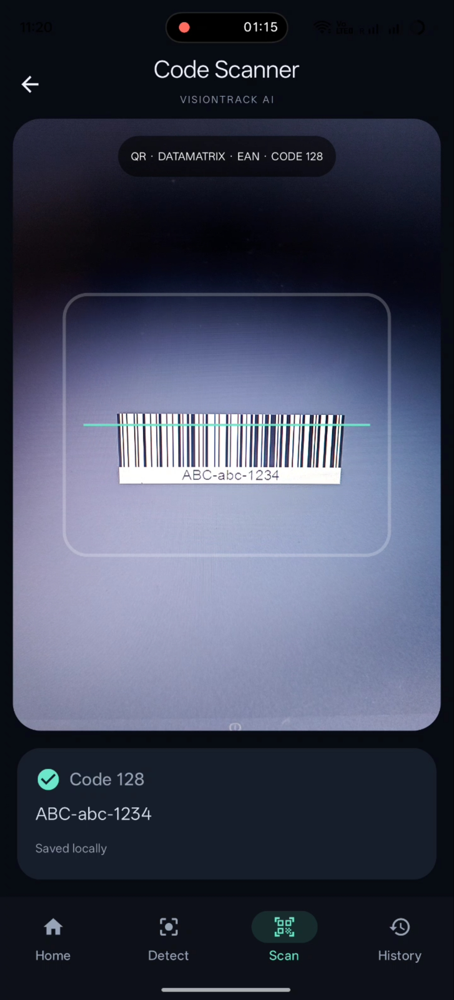
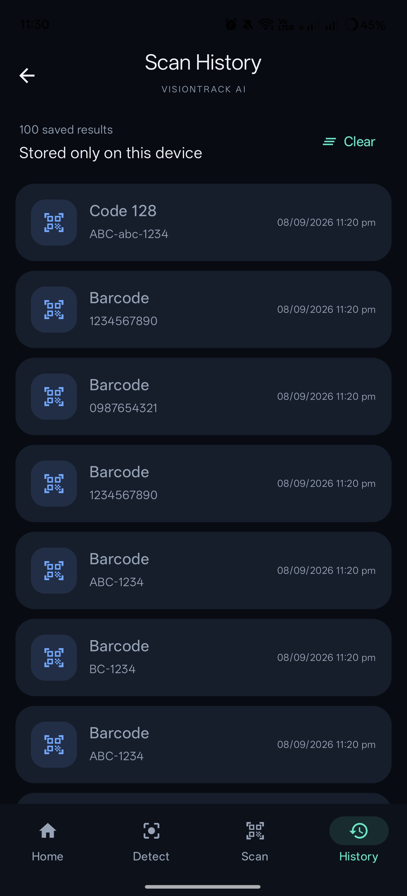

# VisionTrack AI

**Native Android computer vision that runs fully on-device.**

VisionTrack AI is a portfolio project built to demonstrate practical mobile AI engineering: native Android development, camera integration, object detection, barcode recognition, edge inference, and local-first data handling.

> **No backend. No cloud inference. No Wi-Fi required.**

---

## Highlights

- **Native Android** — Kotlin + Jetpack Compose
- **On-device object detection** — YOLO26n exported to ONNX
- **Edge inference** — ONNX Runtime Android
- **Camera integration** — CameraX
- **Barcode recognition** — QR, DataMatrix, EAN, Code 128 and more
- **Local history** — scan results are stored only on the device
- **Offline-first** — the entire app continues working without network access
- **Privacy-friendly** — captured images do not leave the device

---

## Screenshots

<p align="center">
  
  
  
  
</p>

<p align="center">
  <sub>
    Home &nbsp;&nbsp;&nbsp;&nbsp;&nbsp;
    Object Detection &nbsp;&nbsp;&nbsp;&nbsp;&nbsp;
    Barcode Scanner &nbsp;&nbsp;&nbsp;&nbsp;&nbsp;
    History
  </sub>
</p>

---

## Demo

### Home

The home screen provides a product-style dashboard with:

- offline AI status
- YOLO model/runtime information
- recent activity
- object detection
- barcode scanning
- local scan history

### Object Detection

```text
CameraX
   ↓
Capture image
   ↓
Resize + normalize
   ↓
YOLO26n ONNX
   ↓
ONNX Runtime
   ↓
Decode predictions
   ↓
Non-Max Suppression
   ↓
Bounding boxes + confidence
