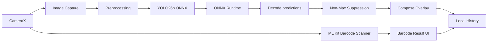

# Architecture

## Overview

VisionTrack AI is intentionally designed as a local-first edge AI application.



## Object Detection

The object detection path is completely local:

1. CameraX captures a JPEG.
2. Android decodes it into a bitmap.
3. The bitmap is resized to the YOLO input resolution.
4. Pixel values are normalized to `[0, 1]`.
5. The application builds an NCHW tensor.
6. ONNX Runtime executes the model.
7. Predictions are decoded into classes and boxes.
8. Confidence thresholding removes weak detections.
9. Non-Max Suppression removes overlapping boxes.
10. Coordinates are mapped back to the source image.
11. Jetpack Compose renders the result.

## Barcode Recognition

Barcode recognition uses ML Kit independently from YOLO because structured code recognition is a specialized problem.

The analyzer uses CameraX `ImageAnalysis` with:

```text
STRATEGY_KEEP_ONLY_LATEST
```

This prevents a growing frame-processing queue.

## Persistence

Recent results are stored locally with SharedPreferences.

This keeps the prototype lightweight while demonstrating persistence. A production version could migrate to Room.

## Privacy Boundary

No captured image is intentionally transmitted outside the device.

```text
Device boundary
┌──────────────────────────────┐
│ Camera                       │
│ YOLO / ONNX Runtime          │
│ ML Kit                       │
│ History                      │
│ UI                           │
└──────────────────────────────┘
```

## Future Architecture

A production extension could introduce:

```text
Phone
  ├── local detection
  ├── local barcode scan
  │
  └── optional authenticated sync
            ↓
         API
            ↓
   component registry
```

The AI inference can remain local even if a backend is later added for synchronized component metadata.
